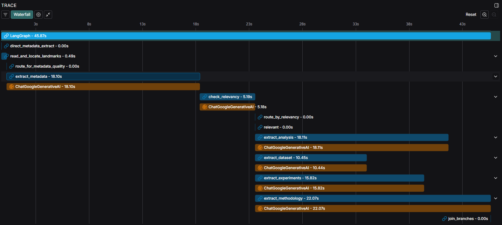

# LLM based Literature Survey Framework



This project is an automated framework designed to perform comprehensive literature surveys on scientific papers. It leverages a pipeline built with LangGraph to ingest PDF documents, perform multi-tiered metadata extraction, check for topical relevancy, and run parallel analysis using Google's Gemini Pro model.

The extracted data is stored in a structured SQLite database and can be visualized and compared through an interactive Streamlit dashboard.

## Core Features

-   **Stateful Processing with LangGraph:** Utilizes a stateful graph to manage the entire paper processing workflow, from ingestion to final analysis.
-   **Multi-Tiered Metadata Extraction:** Employs a layered approach for accurate extraction strategy:
    1.  **Direct Extraction:** Instantly reads the PDF's internal metadata for a fast first pass. (Try to extract deterministic components)
    2.  **RE-based Landmarking:** Uses deterministic regex to locate key sections (Abstract, Introduction) without relying on an LLM. (Try to extract based on deterministic components)
    3.  **OCR Fallback:** Automatically performs OCR on the first page if standard text extraction fails to find key landmarks.
    4.  **LLM based metadata extraction:** Uses LLM to fill in any metadata after the direct extraction, handling complex and non-linear document layouts.
        - Most Elsevier documents are straight forward as the structure of the PDF is maintained. Some manuscripts use text blocks when build the PDF which results non-structured text after extracting through PyMuPDF.
          - Standard structure: Journal headers, Title, Author information, Abstract, Keywords, Introduction, metadata - doi, author correspondence, year of publishing, End of page.
          - Deviation of the standard structure: Journal header, Keywords, Introduction, metadata - doi, author correspondence, year of publishing, Abstract, End of page.
-   **Parallel Analysis:** After a paper is deemed relevant, the framework runs four distinct analysis tasks in parallel, dramatically speeding up processing time.
-   **LLM-based Analysis:** Leverages `LLM (Gemini 2.5 Pro)` for nuanced tasks like summarizing methodologies, findings, limitations, and experimental setups.
-   **Interactive Dashboard:** A multi-page Streamlit application allows for:
    -   Exploring individual papers in a detailed view.
    -   Comparing key data points across all processed papers in a sortable table.
-   **Clean Architecture & Prompt Management:** Separates application logic (`nodes.py`, `graph.py`), prompts (`src/prompts/`), and the main conductor (`main.py`) for easy maintenance and scalability.
-   **Secure Configuration:** Uses a `.env` file for secure management of API keys, keeping secrets out of the source code.

## Tech Stack

-   **Core Pipeline:** LangGraph, LangChain
-   **LLM:** Google Gemini Pro (`gemini-2.5-pro`)
-   **PDF Processing:** PyMuPDF, Tesseract (for OCR)
-   **Web Dashboard:** Streamlit, Pandas
-   **Database:** SQLite
-   **Configuration:** python-dotenv

## Project Structure

```
.
├── db/                   # Contains the SQLite database files - Output from the LLM based survey agent
│   └── xxx.db
│
├── pages/                # Streamlit pages for the multi-page app
│   └── comparison_table.py
│
├── papers/               # Directory to place input PDF files
│   ├── yyy0.pdf
│   │── yyy1.pdf
│   │── yyy2.pdf
│   │── .
│   │── .
│   └── .
│
├── src/                  # Main source code
│   ├── prompts/          # Houses all prompt templates
│   │   └── water_forecasting_prompts/
│   │       └── prompts.py
│   ├── database.py       # Handles all database interactions (creation, upserting)
│   ├── graph.py          # Defines and compiles the LangGraph structure and routing
│   ├── initialise_state.py # Defines the core State class (data schema) for the graph
│   ├── nodes.py          # Contains all worker functions (nodes) for the graph
│   ├── streamlit_utils.py# Shared utility functions for the Streamlit app
│   └── utils.py          # General utility functions (PDF text/OCR extraction)
│
├── .env                  # Secure file for API keys (MUST NOT be committed)
├── .gitignore            # Specifies files for Git to ignore
├── app.py                # Main entry point for the Streamlit dashboard
├── definitions.py        # Non-secret project constants (e.g., file paths)
├── main.py               # Main entry point for the data processing pipeline
├── rename_files.py       # Manuscript pdfs are rename to a sequence of integer values (yyy0 - 0, yyy1 - 1, yyy2 - 2, ...)
└── readme.md             # This file
```

## Setup and Installation

1.  **Clone the Repository**
    ```bash
    git clone <your-repository-url>
    cd literaturereview
    ```

2.  **Set Up an Environment**
    - Install all the required Python libraries using the environment.yml file.
    ```bash
    conda create -n <environment-name> --environment.yml
    ```
    *Note: This project requires Tesseract OCR to be installed on your system for the OCR fallback to work. Please follow the installation guide for your OS.*

3.  **Set Up Environment Variables**
    -   Create a file named `.env` in the root directory.
    -   Add your Google API key to this file:
    ```
    GOOGLE_API_KEY="your_google_api_key_here"
    ```
    The `.gitignore` file is already configured to ignore this file for security.

4.  **Add Papers**
    - Place all the scientific papers you want to process into the `papers/` directory.

## How to Use

The project has two main functions: processing the papers and viewing the results.

### 0. Initial setup & Preprocessing

- Place the manuscripts as `pdf` files in the folder `paper/`.
- Check/change/define the path to the manuscripts, path to output database.
- Define or update the State variables in `initialise_state.py`. 
- Check `API keys`.
- Run the `rename_files.py` to rename the manuscripts to sequentially integers (`yyy.pdf` to `0.pdf`).  


### 1. Running the Data Processing Pipeline

To start ingesting, analyzing, and saving the papers to the database, run the `main.py` script from the root directory.

```bash
python main.py
```

The script will automatically skip any papers that have already been processed and saved to the database. To wipe the database and start fresh, you can uncomment the `database.reinitialize_database()` line in `main.py`.

### 2. Launching the Streamlit Dashboard

To explore the extracted data, run the `app.py` script.

```bash
streamlit run app.py db/paper.db
```

This will open the interactive dashboard in your web browser, where you can navigate between the "Paper Explorer" and "Comparison Table" pages.

## Workflow Explained

The core pipeline defined in `src/graph.py` follows this intelligent sequence:

1.  **Direct Metadata Extraction:** Tries to get encoded metadata from the PDF's internal dictionary.
2.  **Landmark Location:** Reads the full PDF text and uses fast, deterministic regex to find the character locations of key sections like "Abstract" and "Introduction".
3.  **OCR Fallback (Conditional):** If the key landmarks are not found, the graph automatically routes to an OCR node that processes the first page to get a clean text layer and re-locates the landmarks.
4.  **LLM for metadata extraction:** An LLM with text from the first page of the manuscript. An LLM call is then made to fill in any metadata that was missing from the direct extraction step.
5.  **Relevancy Check:** The extracted abstract is used to determine if the paper is relevant to the research topic.
6.  **Parallel Analysis (Conditional):** If the paper is relevant, the graph forks into four parallel branches, simultaneously extracting:
    -   Methodology, USP, and Models
    -   Analysis and Findings (Problem Statement, Results, Limitations)
    -   Dataset Properties
    -   Experimental Setup
7.  **Join and Save:** The parallel branches join, and the final, complete state object is saved to the SQLite database.

## Future Work
-   [ ] **Ability to choose LLM models:** Extend from `Gemini 2.5 Pro` to other local LLMs and commerical LLMs with API key access. 
  - Local LLMs tried include `phi3:3.8b` & `llama3.1:8b-instruct-q4_K_M`. Works decent for extracting metadata from the first page of the manuscript. 
  - Required larger model for extracting from the entire manuscript (or)
  - Iterate over smaller chunks (chapters, pages, subsections) of the manuscript to identify the presence of required information in the chunk, and then extract.
  - Smaller models seemed to get lost with larger number of tokens, and get confused. 
-   [ ] **Standardisation of Extracted Data:** The extracted elements such as `dataset name`, `data availability`, `resolution`, etc, can have the same information represented in different manners (for `dataset name`, we can have `MNIST, The MNIST dataset, Modified National Institute of Standards and Technology`)
-   [ ] **Knowledge Graph Integration:** Use the extracted entities (e.g., `proposed_model_name`, `experimental_methods`) to build a Neo4j or similar knowledge graph.
-   [ ] **RAG Pipeline:** Implement a Retrieval-Augmented Generation pipeline to allow for natural language questions over the entire corpus of processed literature.

## 🤝 Contributing
Contributions, issues, and feature requests are welcome!

## 📄 License
This project is licensed under the MIT License.